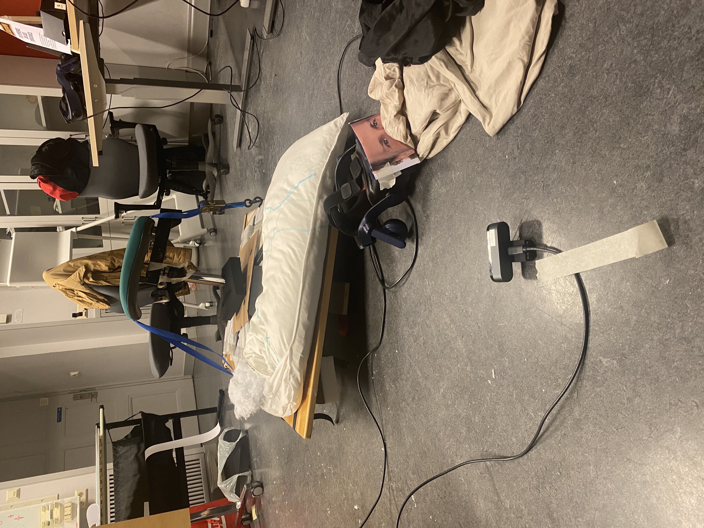
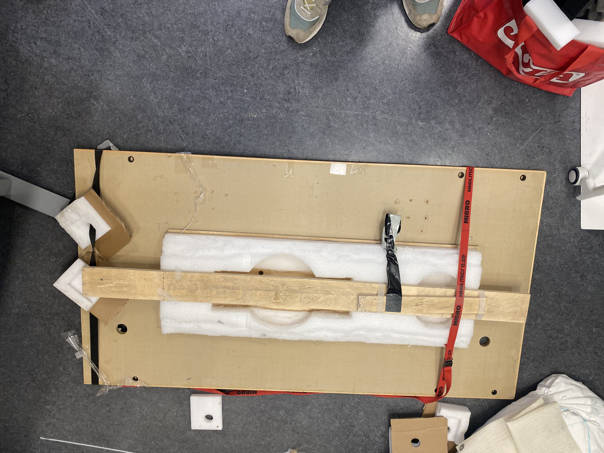

# Dragon Trainer 

## How to run Dragon Trainer
There are multiple parts that are needed in order to provide the full experience of this project. The parts that are needed are the following:
- Two HTC VIVE headsets, one HTC VIVE Controller, three HTC VIVE trackers, a HTC VIVE room setup.
- Two computers that can run the Unity project and the HTC Vive headsets.
- A board that can tilt left and right as well as a chair that can be mounted on the board (see board setup for details).
- Alternatively a third computer that runs the spectator view.

## Board setup
The board that was built for our project was made using a table top, soft and medium soft foam, some planks, ratchet straps, and an office chair without the back and arm rests. 

(Fig 1. Full Setup)

(Fig 2. Bottom of board)

(Fig 3. Top down view of bottom of board)

One of the HTC VIVE trackers should be mounted on the chair, this sensor will keep track of the players tilt angle which will control stearing left and right.

### Mouth recognition for fire breathing
Alternativly (this does not work perfectly and was not used at the open house) you can also set up the camera (Fig 1) and use the OpenCV face recognition script (main.py) before starting the Unity project to breath fire by opening the dragons mouth. You will also need to disable constant firing in the vfx_DragonBreath -> Dragon_Breath game object. In The gameobject FaceDetectionReviecer (Misspelled, I know) you can edit port for the connection with the python script.

## Unity setup (General)
Setups that all computers need to follow
- "SampleScene" is the main Scene.

## Unity setup (Rider)
Setup specific for the rider
## Unity setup (Dragon)
Setup specific for the dragon
## Unity setup (Spectator)
Setup specific for the spectator view